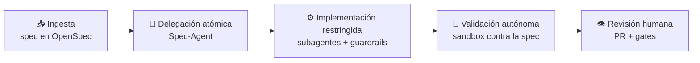

# Spec Sentinel SDK

> **Ingeniería de software para el desarrollo asistido por IA.**
> Un framework portable que convierte *reglas que el agente debería seguir* en *reglas que el agente **no puede** violar*.

→ **La spec es el contrato.** El código se valida contra la especificación, no al revés.
→ **Enforcement, no sugerencias.** Si una regla importa, se hace imposible de saltar.
→ **Contexto acotado.** Subagentes especializados, trabajo atómico, revisión humana al final.
→ **Portable.** Importable en cualquier proyecto, con cualquier copilot.

---

## ✨ ¿Por qué Spec Sentinel?

Los agentes de IA ya escriben código competente, pero sin las garantías que la ingeniería de
software lleva décadas construyendo: una especificación que actúe como contrato, fronteras
arquitectónicas verificables y gates de calidad que no dependan de la buena voluntad de quien
—o de *lo que*— escribe el código. El resultado es conocido: velocidad al principio, deriva
arquitectónica y deuda invisible después.

La respuesta habitual —pedirle al agente que siga las reglas mediante prompts e instrucciones—
no es ingeniería: es confianza. **Y la confianza no escala.**

Spec Sentinel aplica **defensa en profundidad** en cuatro capas, de la más blanda a la más dura:

| Capa | Mecanismo | El agente… |
|---|---|---|
| 1 · Prompt | Instrucciones, estándares, skills | *debería* cumplir |
| 2 · Tool | Hooks que **bloquean** acciones del agente | *no puede* violar |
| 3 · Git | git hooks (commit-msg, pre-commit, pre-push) | *no puede* commitear |
| 4 · CI | Gate de PR (lint, static, tests, secretos) | *no puede* mergear |

## 🧭 Cómo funciona

Ciclo de vida canalizado, con [OpenSpec](https://github.com/Fission-AI/OpenSpec) como fuente
única de verdad:

1. **Ingesta y mapeo** — el framework absorbe la especificación (ticket, PDF, documento → spec).
2. **Delegación atómica** — el *Spec-Agent* fragmenta el trabajo y lo reparte a subagentes
   especializados (Backend, Ops, Tooling), cada uno con contexto delimitado.
3. **Implementación restringida** — el código se escribe dentro de los guardarraíles de
   arquitectura; las acciones prohibidas se bloquean a nivel de tool.
4. **Validación autónoma** — todo se ejecuta y valida en sandbox contra la spec antes de
   cualquier commit.
5. **Revisión humana** — el desarrollador revisa el paquete consolidado; los gates de git y CI
   cierran el bucle.

## 🧩 Qué incluirá

- 🛡️ **Gobernanza dura del agente** — hooks residentes que bloquean acciones
  (ramas protegidas, ficheros gestionados, comandos destructivos). *La joya del framework.*
- 🔗 **Quality gates instalables** — git hooks, commitlint, gitleaks y CI gate de PR como
  templates listos para importar.
- 🤖 **Subagentes especializados** — Spec-Agent (orquestador), Backend-Agent, Ops-Agent,
  Tooling-Agent, con contexto acotado para evitar alucinaciones.
- 🧰 **Skills portables** — intake de specs (ticket/PDF → spec), ciclo de PR, breakdown de
  tareas, sincronización de repos.
- 📦 **Distribución multi-copilot** — zero-config, compatible con Claude, Gemini, Codex y
  otros asistentes vía instrucciones versionadas.
- 🚢 **Ciclo de release** — versionado semántico con ramas de mantenimiento y perfil opcional
  de deploy + rollback.

## 🗺️ Roadmap

El framework se construirá con su propio método (*dogfooding* sobre OpenSpec): cada fase ≈ un
cambio de spec, una PR.

- [ ] **1. Base portable** — multi-copilot + estándares + flujo OpenSpec
- [ ] **2. Gobernanza del agente** — hooks que bloquean acciones *(arranque recomendado: máximo valor, menor coste)*
- [ ] **3. git hooks + commitlint + gitleaks** — template + instalador
- [ ] **4. CI gate de PR** — template Node; perfil PHP
- [ ] **5. Fronteras de arquitectura** — dependency-cruiser + spec-order-markers + tabla de decisiones
- [ ] **6. Skills portables** — intake de specs, PR lifecycle
- [ ] **7. Perfil de despliegue** *(opcional)* — deploy + rollback

## 🚧 Estado

**Fase de definición.** Existe la visión y el análisis; aún no hay código ni estructura de
proyecto. Las decisiones abiertas (punto de partida, stack por defecto, alcance del enforcement,
SDK vs. plantilla) están recogidas en el §7 del [análisis](docs/00-analisis-y-vision.md).

## 🙏 Agradecimientos

- [OpenSpec](https://github.com/Fission-AI/OpenSpec) — el método SDD sobre el que se apoya todo.
- [LIDR Academy · specboot](https://github.com/LIDR-academy/lidr-specboot) — referencia de
  distribución portable multi-copilot.

## 📄 Licencia

Código abierto bajo licencia [MIT](LICENSE).
