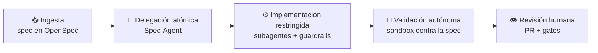

# Spec Sentinel SDK

> **Ingeniería de software para el desarrollo asistido por IA.**
> Un framework portable que convierte *reglas que el agente debería seguir* en *reglas que el agente **no puede** violar*.

→ **La spec es el contrato.** El código se valida contra la especificación, no al revés.
→ **Enforcement, no sugerencias.** Si una regla importa, se hace imposible de saltar.
→ **Contexto acotado.** Subagentes especializados, trabajo atómico, revisión humana al final.
→ **Portable.** Importable en cualquier proyecto, con cualquier copilot.

---

## ✨ ¿Por qué Spec Sentinel?

Los agentes de IA ya escriben código competente, pero sin las garantías que la ingeniería de
software lleva décadas construyendo: una especificación que actúe como contrato, fronteras
arquitectónicas verificables y gates de calidad que no dependan de la buena voluntad de quien
—o de *lo que*— escribe el código. El resultado es conocido: velocidad al principio, deriva
arquitectónica y deuda invisible después.

La respuesta habitual —pedirle al agente que siga las reglas mediante prompts e instrucciones—
no es ingeniería: es confianza. **Y la confianza no escala.**

## 🧱 Las cuatro capas

Vocabulario completo en [docs/05-semantica.md](docs/05-semantica.md).

| Capa | Responde a | Qué es |
|---|---|---|
| **Engine** | ¿Qué hay que hacer y quién lo hace? | El método: OpenSpec y todo su ciclo (spec → tareas → código → verificación), las skills y los perfiles que **producen** |
| **Shield** | ¿Qué no se puede hacer? | Las reglas estrictas: gitflow, conventional commits, ramas protegidas, tests, secretos. Imposibles de saltar, no opcionales |
| **Tribunal** | ¿Esto está bien? | Los perfiles que **evalúan** y sus artefactos: panel adversarial de tres lentes y veredicto `SHIP / CONDITIONAL / HOLD` |
| **Delivery** | ¿Cómo llega a producción y qué cuesta? | Release por entornos, carril de hotfix, instalación y medición (KPIs, bitácora, `doctor`) |

La frontera entre **Engine** y **Tribunal** es la separación de poderes: quien produce no juzga
su propio trabajo.

**Shield** se aplica en cuatro puestos, cada uno en un momento distinto del camino — y cada uno
tapa el hueco del anterior:

| Puesto | Momento | El agente… |
|---|---|---|
| **Canon** | La intención — instrucciones, estándares, skills | *debería* cumplir |
| **Centinela** | La acción — un hook la intercepta antes de ejecutarse | *no puede* violar |
| **Esclusa** | El registro — git hooks (commit-msg, pre-commit, pre-push) | *no puede* commitear |
| **Aduana** | La integración — gate de PR en CI | *no puede* mergear |

## 🧭 Cómo funciona

Ciclo de vida canalizado, con [OpenSpec](https://github.com/Fission-AI/OpenSpec) como fuente
única de verdad:

1. **Ingesta y mapeo** — el framework absorbe la especificación (ticket, PDF, documento → spec).
2. **Delegación atómica** — el *Spec-Agent* fragmenta el trabajo y lo reparte a subagentes
   especializados (Backend, Ops, Tooling), cada uno con contexto delimitado.
3. **Implementación restringida** — el código se escribe dentro de los guardarraíles de
   arquitectura; las acciones prohibidas se bloquean a nivel de tool.
4. **Validación autónoma** — todo se ejecuta y valida en sandbox contra la spec antes de
   cualquier commit.
5. **Revisión humana** — el desarrollador revisa el paquete consolidado; los gates de git y CI
   cierran el bucle.

## 🧩 Qué incluirá

- 🛡️ **Gobernanza dura del agente** — hooks residentes que bloquean acciones
  (ramas protegidas, ficheros gestionados, comandos destructivos). *La joya del framework.*
- 🔗 **Quality gates instalables** — git hooks, commitlint, gitleaks y CI gate de PR como
  templates listos para importar.
- 🤖 **Subagentes especializados** — Spec-Agent (orquestador), Backend-Agent, Ops-Agent,
  Tooling-Agent, con contexto acotado para evitar alucinaciones.
- 🧰 **Skills portables y verificables** — intake de specs (ticket/PDF → spec), ciclo de PR,
  breakdown de tareas, sincronización de repos. Toda skill sigue una anatomía estándar
  (*process, not prose*): pasos con checkpoints, tabla de anti-racionalizaciones y
  verificación con evidencia medible — "parece correcto" nunca basta.
- 📦 **Distribución multi-copilot** — zero-config, compatible con Claude, Gemini, Codex y
  otros asistentes vía instrucciones versionadas.
- 🚢 **Ciclo de release** — versionado semántico con ramas de mantenimiento y perfil opcional
  de deploy + rollback.

## 🗺️ Roadmap

El framework se construye con su propio método (*dogfooding* sobre OpenSpec): cada fase = un
cambio en `openspec/changes/`. Se adopta por **tiers**: Tier 0 (solo guardarraíles, sin exigir
OpenSpec) → Tier 1 (ciclo SDD + `spec-coverage`) → Tier 2 (equipo de subagentes).

- [x] **0. bootstrap-method** — decisiones cerradas, esqueleto, OpenSpec operativo, fixture
- [ ] **1. sentinel-guard** — hook único de política + break-glass auditado *(Tier 0)*
- [ ] **2. git-gates** — git hooks + commitlint + gitleaks + instalador *(Tier 0)*
- [ ] **3. ci-gate + spec-coverage CLI** — gate de PR + la matriz escenario↔test como CLI standalone *(Tier 0/1)*
- [ ] **4. sdd-cycle** — skills del ciclo + doctor + brownfield "spec on first touch" *(Tier 1)*
- [ ] **5. release-hotfix** — release multicanal por entorno + carril hotfix *(Tier 1)*
- [ ] **6. team** — subagentes con manifiestos de contexto + panel adversarial *(Tier 2)*
- [ ] **7. agent-run-audit** *(opcional)* — auditoría de ejecuciones de agente

## 🚧 Estado

**Fase 0 completada y archivada** — el repo se desarrolla con su propio método y ya existe la
primera spec viva ([`openspec/specs/sdk-method/`](openspec/specs/sdk-method/spec.md)). La foto
actual (roadmap + ciclo + salud) vive siempre en **[STATUS.md](STATUS.md)**; el plan completo,
en [docs/01-plan-maestro.md](docs/01-plan-maestro.md).

## 🙏 Agradecimientos

- [OpenSpec](https://github.com/Fission-AI/OpenSpec) — el método SDD sobre el que se apoya todo.
- [LIDR Academy · specboot](https://github.com/LIDR-academy/lidr-specboot) — referencia de
  distribución portable multi-copilot.
- [Addy Osmani · agent-skills](https://github.com/addyosmani/agent-skills) — referencia del
  estándar de autoría de skills verificables para agentes de código.

## 📄 Licencia

Código abierto bajo licencia [MIT](LICENSE).
