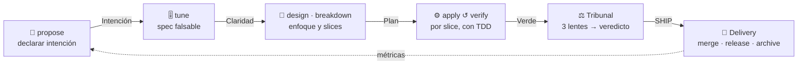

# Spec Sentinel SDK

> **Ingeniería de software para el desarrollo asistido por IA.**
> Un framework portable que convierte *reglas que el agente debería seguir* en *reglas que el agente **no puede** violar*.

→ **La spec es el contrato.** El código se valida contra la especificación, no al revés.
→ **Enforcement, no sugerencias.** Si una regla importa, se hace imposible de saltar.
→ **Contexto acotado.** Subagentes especializados, trabajo atómico, revisión humana al final.
→ **Portable.** Importable en cualquier proyecto, con cualquier copilot.

---

## ✨ ¿Por qué Spec Sentinel?

Los agentes de IA ya escriben código competente, pero sin las garantías que la ingeniería de
software lleva décadas construyendo: una especificación que actúe como contrato, fronteras
arquitectónicas verificables y gates de calidad que no dependan de la buena voluntad de quien
—o de *lo que*— escribe el código. El resultado es conocido: velocidad al principio, deriva
arquitectónica y deuda invisible después.

La respuesta habitual —pedirle al agente que siga las reglas mediante prompts e instrucciones—
no es ingeniería: es confianza. **Y la confianza no escala.**

## 🔁 El Loop

Un cambio no atraviesa una pila de capas: **da una vuelta**. Tres stages lo producen, lo juzgan
y lo entregan; **Shield** es transversal y está siempre encendido. Vocabulario completo en
[docs/05-semantica.md](docs/05-semantica.md).

| Stage | Responde a | Steps |
|---|---|---|
| **Engine** | ¿Qué hay que hacer y quién lo hace? | `discover` → `propose` → `tune` → `design` → `breakdown` → `apply` ↺ `verify` |
| **Tribunal** | ¿Esto está bien? | `review` → `counter-review` → `synthesis` → `disposition` |
| **Delivery** | ¿Cómo llega a producción y qué cuesta? | `merge` → `release` → `deploy` → `archive` → `measure` |
| **Shield** *(transversal)* | ¿Qué no se puede hacer? | Gitflow, conventional commits, ramas protegidas, tests, secretos |

La frontera entre **Engine** y **Tribunal** es la separación de poderes: quien produce no juzga
su propio trabajo. Y cada step se cierra con un **gate** — Claridad, Verde, Veredicto, Aduana…

**Shield** se aplica en cuatro puestos, cada uno en un momento distinto — y cada uno tapa el
hueco del anterior:

| Puesto | Momento | El agente… |
|---|---|---|
| **Canon** | La intención — instrucciones, estándares, skills | *debería* cumplir |
| **Centinela** | La acción — un hook la intercepta antes de ejecutarse | *no puede* violar |
| **Esclusa** | El registro — git hooks (commit-msg, pre-commit, pre-push) | *no puede* commitear |
| **Aduana** | La integración — gate de PR en CI | *no puede* mergear |

## 🧭 Cómo funciona

Un cambio recorre el Loop y **cada step se cierra con un gate**. Si un gate falla, hay un
camino de vuelta definido — y cuanto más arriba se descubra el fallo, más barato es
(detalle en [la semántica](docs/05-semantica.md)):

1. **`propose`** — se abre el expediente y se declara la intención. Descartar aquí cuesta un
   párrafo: es el gate más barato del Loop.
2. **`tune`** — la spec se afina en rondas hasta que cada escenario es falsable.
3. **`design` · `breakdown`** — el enfoque técnico y, solo entonces, el troceado en slices
   mergeables por separado.
4. **`apply` ↺ `verify`** — bucle por slice con TDD; los hooks de Shield bloquean en el acto.
5. **Tribunal** — tres lentes independientes y un veredicto que calcula código, no un LLM.
6. **Delivery** — a producción por canal de entorno, y el expediente se archiva convirtiendo
   su delta en contrato vigente.

## 🧩 Qué incluirá

- 🛡️ **Gobernanza dura del agente** — hooks residentes que bloquean acciones
  (ramas protegidas, ficheros gestionados, comandos destructivos). *La joya del framework.*
- 🔗 **Quality gates instalables** — git hooks, commitlint, gitleaks y CI gate de PR como
  templates listos para importar.
- 🤖 **Perfiles especializados** — orquestador, analista, arquitecto, developer, QA y datos
  producen (Engine); tres lentes independientes juzgan (Tribunal). Contexto acotado y
  separación de poderes: quien produce no juzga.
- 🧰 **Skills portables y verificables** — intake de specs (ticket/PDF → spec), ciclo de PR,
  breakdown de tareas, sincronización de repos. Toda skill sigue una anatomía estándar
  (*process, not prose*): pasos con checkpoints, tabla de anti-racionalizaciones y
  verificación con evidencia medible — "parece correcto" nunca basta.
- 📦 **Distribución multi-copilot** — zero-config, compatible con Claude, Gemini, Codex y
  otros asistentes vía instrucciones versionadas.
- 🚢 **Ciclo de release** — versionado semántico con ramas de mantenimiento y perfil opcional
  de deploy + rollback.

## 🗺️ Roadmap

El framework se construye con su propio método (*dogfooding* sobre OpenSpec): cada fase = un
cambio en `openspec/changes/`. Se adopta por **niveles**: **Guardia** (solo Shield, sin exigir
OpenSpec) → **Método** (+ Engine: ciclo SDD y `spec-coverage`) → **Equipo** (+ Tribunal).

- [x] **0. bootstrap-method** — decisiones cerradas, esqueleto, OpenSpec operativo, fixture
- [x] **1. sentinel-guard** — hook único de política + break-glass auditado *(Guardia)*
- [ ] **2. git-gates** — git hooks + commitlint + gitleaks + instalador *(Guardia)* · ⏸️ aparcada
- [ ] **3. ci-gate + spec-coverage CLI** — gate de PR + la matriz escenario↔test como CLI standalone *(Guardia/Método)*
- [ ] **4. sdd-cycle** — skills del ciclo + doctor + brownfield "spec on first touch" *(Método)*
- [ ] **5. release-hotfix** — release multicanal por entorno + carril hotfix *(Método)*
- [ ] **6. team** — subagentes con manifiestos de contexto + panel adversarial *(Equipo)*
- [ ] **7. agent-run-audit** *(opcional)* — auditoría de ejecuciones de agente

## 🚧 Estado

**Fases 0 y 1 archivadas.** El repo se desarrolla con su propio método y el puesto
**Centinela** ya está activo aquí: hay dos specs vivas
([`sdk-method`](openspec/specs/sdk-method/spec.md),
[`sentinel-guard`](openspec/specs/sentinel-guard/spec.md)) y 15 casos en el banco de pruebas.
La foto actual vive siempre en **[STATUS.md](STATUS.md)**; el vocabulario en
**[docs/05-semantica.md](docs/05-semantica.md)**; el plan completo en
[docs/01-plan-maestro.md](docs/01-plan-maestro.md).

## 🙏 Agradecimientos

- [OpenSpec](https://github.com/Fission-AI/OpenSpec) — el método SDD sobre el que se apoya todo.
- [LIDR Academy · specboot](https://github.com/LIDR-academy/lidr-specboot) — referencia de
  distribución portable multi-copilot.
- [Addy Osmani · agent-skills](https://github.com/addyosmani/agent-skills) — referencia del
  estándar de autoría de skills verificables para agentes de código.

## 📄 Licencia

Código abierto bajo licencia [MIT](LICENSE).
